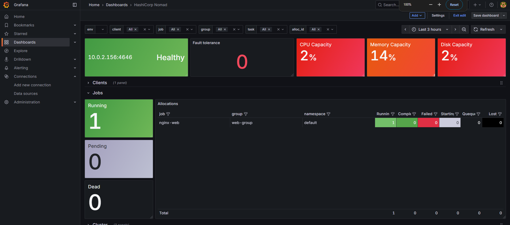

# Nomad Cluster Infrastructure Project

A **production-ready, secure HashiCorp Nomad cluster** deployed on AWS using Terraform, with custom AMI builds via Packer and automated CI/CD pipelines. This project demonstrates infrastructure-as-code best practices, secure networking, and comprehensive observability.

## 🏗️ Architecture Overview

- **VPC with Private/Public Subnets** - Network isolation and security
- **Bastion Host** - Secure gateway for cluster access
- **Nomad Server** - Control plane with bootstrap configuration
- **Nomad Client** - Workload execution nodes with Docker
- **Custom AMIs** - Packer-built base images with pre-installed dependencies
- **Monitoring Stack** - Prometheus & Grafana for observability
- **CI/CD Pipeline** - Automated deployment with GitHub Actions

---

## 🚀 Quick Start

### Prerequisites
- AWS CLI configured with appropriate permissions
- Terraform >= 1.5
- SSH key pair for EC2 access
- GitHub repository with secrets configured

### 1. Clone and Initialize
```bash
git clone https://github.com/Vaibhav871/Nomad-cluster-infrastructure-Project.git
cd Nomad-cluster-infrastructure-Project
terraform init
```

### 2. Deploy Infrastructure
```bash
terraform plan -out=tfplan
terraform apply tfplan
```

---

## 🔐 Secure Access Methods

### SSH Access via SSH Agent
**Secure authentication without exposing private keys on remote hosts:**

1. **Start SSH agent and add key**
   ```bash
   eval "$(ssh-agent -s)"
   ssh-add /path/to/your-private-key.pem
   ```

2. **Connect to Bastion with agent forwarding**
   ```bash
   ssh -A ubuntu@<BASTION_PUBLIC_IP>
   ```

3. **Access internal nodes from Bastion**
   ```bash
   ssh ubuntu@<NOMAD_SERVER_PRIVATE_IP>
   ssh ubuntu@<NOMAD_CLIENT_PRIVATE_IP>
   ```

### Nomad UI Access via SSH Tunnel
**Securely access Nomad web interface through Bastion:**

```bash
ssh -i .ssh/bastionkey -L 4646:<nomad-server-ip>:4646 ubuntu@<bastion-serevr-ip>
```

Then open: **http://localhost:4646** in your browser

### Prometheus & Grafana Access via SSH Tunnel
**Monitor cluster metrics securely:**

1. **Prometheus access**
   ```bash
   http://<bastion-public-ip>:9090
   ```

2. **Grafana dashboard access**
   ```bash
   http://<bastion-public-ip>:3000
   ```

---

## 📱 Application Access

### Deployed Application via Nomad Client
Applications deployed through Nomad are accessible via the client nodes:

1. **Check running jobs**
   ```bash
   nomad status
   nomad status nginix-web
   ```

2. **Access application**
   ```bash
   # If application exposes port 8080
   ssh -i ./NomadCluster/.ssh/bastionkey -L 8080:10.0.2.250:8080 ubuntu@<BASTION_IP>
   ```
   Access: **http://localhost:8080**

3. **Direct client access (from Bastion)**
   ```bash
   curl http://<NOMAD_CLIENT_IP>:<APP_PORT>
   ```

---

## 🛡️ Security Best Practices Implemented

### Network Security
- **Private subnets** for all Nomad nodes (no direct internet access)
- **Bastion host** as single point of entry with restricted security groups
- **Security group rules** following principle of least privilege
- **No public IPs** on Nomad server instances

### Access Control
- **SSH key-based authentication** only (no password authentication)
- **SSH agent forwarding** to avoid private key exposure on remote hosts
- **IAM roles** with minimal required permissions for EC2 instances

### Infrastructure Security
- **Encrypted EBS volumes** for all instances
- **Secrets management** via GitHub Secrets (never exposed in code)

### CI/CD Security
- **GitHub Secrets** used for sensitive variables (AWS credentials, SSH keys)
- **No hardcoded credentials** in Terraform or configuration files
- **Scoped IAM roles** for deployment automation
- **Terraform state** stored securely (remote backend recommended)

---

## 🏗️ Custom AMI with Packer

This project uses **Packer to build custom AMIs** with pre-installed dependencies:

### AMI Components
- **Base OS**: Ubuntu 22.04 LTS
- **Docker Engine**: Pre-installed and configured
- **Nomad Binary**: Latest stable version
- **System dependencies**: curl, wget, unzip, jq
- **Security hardening**: Automatic security updates, SSH configuration

### Building Custom AMI
```bash
cd packer/
packer build nomad-server.pkr.hcl -var-file=/.variables.pkr.hcl
```

---

## 🔄 CI/CD Pipeline Integration

### GitHub Secrets Configuration
Required secrets for automated deployment:

```
## 🔑 GitHub Secrets and Terraform Variables

### AWS and Region Settings
- `AWS_ACCESS_KEY_ID`  
- `AWS_SECRET_ACCESS_KEY`  
- `AWS_REGION`  

### AMI and Instance Configuration
- `BASE_AMI`  
- `INSTANCE_TYPE`  
- `ROOT_VOLUME_SIZE`    

### Nomad and Application Settings
- `NOMAD_DOWNLOAD_URL`  
- `NOMAD_VERSION`  

### SSH and Access Management
- `SSH_USERNAME`  

### Availability and Region Zones
- `TF_VAR_REGION`  
- `TF_VAR_AVAILABILITY_ZONE`  

### Terraform Variables
- `TF_VAR_S3_BUCKET_NAME`  
- `TF_VAR_VPC_CIDR`  
- `TF_VAR_BASTION_PUBLIC_KEY`  
- `TF_VAR_KEY_NAME`  
- `TF_VAR_NOMAD_AMI_ID`  
- `TF_VAR_NOMAD_CLIENT_COUNT`  
- `TF_VAR_PRIVATE_SUBNET_CIDR`  
- `TF_VAR_PUBLIC_SUBNET_CIDR`  
- `TF_VAR_REGION`  
- `TF_VAR_INSTANCE_TYPE`  
- `TF_VAR_ADMIN_CIDR`  
---

```

### Pipeline Features
- **Automated Terraform deployment** on pull request merge
- **Infrastructure validation** and security scanning

---

## 📊 Monitoring & Observability

### Prometheus Metrics
- **Nomad cluster health** and job status
- **Application performance** metrics
- **Custom business metrics** via service discovery

### Grafana Dashboards
- **Nomad cluster overview** - Jobs, allocations, nodes
- **Application dashboards** - Service-specific metrics
``` <bastio_server_ip:3000> ```

---

## 🧹 Cleanup

Destroy all resources when no longer needed:
```bash
terraform destroy
```
---

## 📚 Additional Resources

- [HashiCorp Nomad Documentation](https://developer.hashicorp.com/nomad)
- [Terraform AWS Provider](https://registry.terraform.io/providers/hashicorp/aws/latest/docs)
- [Packer Documentation](https://developer.hashicorp.com/packer)




